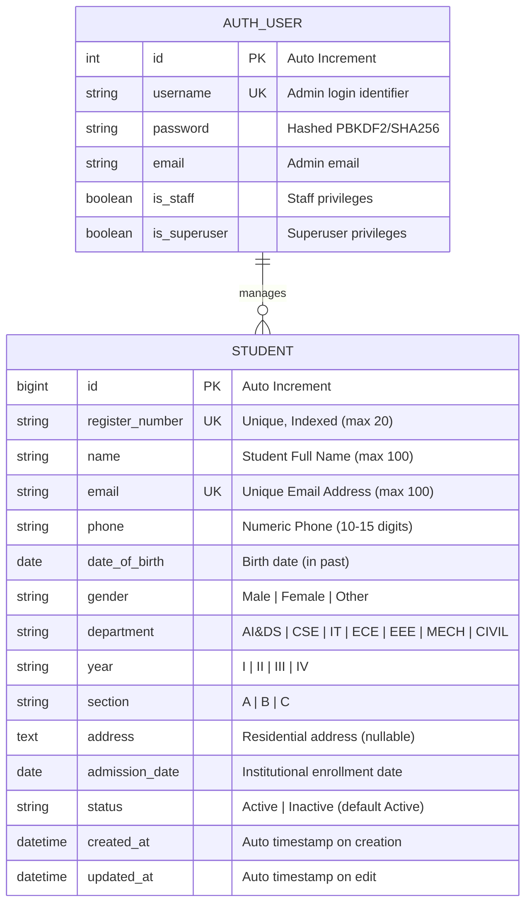

# Database Design: Student Management System

## 1. Entity Relationship (ER) Diagram



---

## 2. Table Data Dictionary: `students_student`

| Column Name | SQL Data Type | Django Field Type | Nullable | Constraints & Rules | Description |
|---|---|---|:---:|---|---|
| `id` | `INTEGER` | `BigAutoField` | No | Primary Key, Auto-increment | Unique system identifier for record. |
| `register_number` | `VARCHAR(20)` | `CharField` | No | Unique, `db_index=True`, Case-insensitive validation | Institutional Roll / Register Number (e.g., `25AD3018`). |
| `name` | `VARCHAR(100)` | `CharField` | No | Min length: 2 chars | Full name of the student. |
| `email` | `VARCHAR(100)` | `EmailField` | No | Unique, Valid RFC email format | Official student communication email. |
| `phone` | `VARCHAR(15)` | `CharField` | No | 10 to 15 numeric digits | Contact mobile number. |
| `date_of_birth` | `DATE` | `DateField` | No | Date must be in the past (`< today`) | Date of birth for age verification. |
| `gender` | `VARCHAR(10)` | `CharField` | No | Choices: `Male`, `Female`, `Other` | Gender identity. |
| `department` | `VARCHAR(50)` | `CharField` | No | Choices: `AI&DS`, `CSE`, `IT`, `ECE`, `EEE`, `MECH`, `CIVIL` | Academic engineering branch. |
| `year` | `VARCHAR(5)` | `CharField` | No | Choices: `I`, `II`, `III`, `IV` | Current academic year of study. |
| `section` | `VARCHAR(5)` | `CharField` | No | Choices: `A`, `B`, `C` | Assigned class section. |
| `address` | `TEXT` | `TextField` | Yes | Optional / `blank=True`, `null=True` | Full residential address. |
| `admission_date` | `DATE` | `DateField` | No | Defaults to date of entry | Date student was enrolled into college. |
| `status` | `VARCHAR(15)` | `CharField` | No | Choices: `Active`, `Inactive`, Default: `Active` | Academic enrollment status. |
| `created_at` | `DATETIME` | `DateTimeField` | No | `auto_now_add=True` | Record creation audit timestamp. |
| `updated_at` | `DATETIME` | `DateTimeField` | No | `auto_now=True` | Record modification audit timestamp. |

---

## 3. Database Constraints & Integrity Safeguards

1. **Primary Key**: `id` guarantees distinct row identification.
2. **Unique Indexes**:
   - `UNIQUE(register_number)`: Disallows two students having identical registration numbers.
   - `UNIQUE(email)`: Disallows duplicate email registrations across all records.
3. **Foreign Keys & Sessions**:
   - Standard Django `django_session` and `auth_user` tables manage administrator sessions safely without exposing credentials to frontend client scripts.
4. **Ordering**:
   - Default query ordering is set to `-created_at` so newly added students appear at the top of directory listings and dashboard previews.

---

## 4. Sample Record (JSON)

```json
{
  "id": 1,
  "register_number": "25AD3018",
  "name": "Balaji R",
  "email": "balaji@example.com",
  "phone": "9876543210",
  "date_of_birth": "2005-05-14",
  "gender": "Male",
  "department": "AI&DS",
  "year": "I",
  "section": "A",
  "address": "124 Tech Park Avenue, Anna Nagar, Chennai",
  "admission_date": "2025-08-01",
  "status": "Active",
  "created_at": "2026-09-17T13:40:00Z",
  "updated_at": "2026-09-17T13:40:00Z"
}
```
